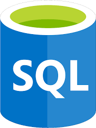

<!---
MuhammadUmerKhan/MuhammadUmerKhan is a ✨ special ✨ repository because its `README.md` (this file) appears on your GitHub profile.
You can click the Preview link to take a look at your changes.
--->

<h1 align="center">Hi there, I'm Muhammad Umer Khan 👋</h1>
---

  

---

  
  
  

I'm an aspiring <strong>Data Scientist</strong> passionate about transforming data into actionable insights and solving real-world problems. Welcome to my GitHub profile, where I showcase my projects, skills, and interests in <strong>Data Science</strong>, <strong>Machine Learning</strong>, <strong>Deep Learning</strong>, and more!

---

## 👨‍💻 About Me

I'm a dedicated **Data Scientist** continually honing my skills and knowledge. My areas of focus include:

- 🤖 **Machine Learning**
- 🧠 **Deep Learning**
- 🗣️ **Natural Language Processing (NLP)**
- 📊 **Time Series Analysis**
- 🎨 **Generative AI**

I'm enthusiastic about creating impactful solutions through data-driven insights and am actively exploring advanced techniques and new frameworks.

### 🔭 Current Focus
- Working on several data science projects while actively seeking opportunities to apply my expertise in a professional setting.
- **Goal**: To contribute to cutting-edge **AI** and **Machine Learning** projects, focusing on practical applications that solve real-world challenges.

### 🌱 Currently Learning
- 👁️ Diving deeper into **Computer Vision**
- 🎵 Exploring **Audio Deep Learning**
- 🛰️ Advancing in **Satellite Image Segmentation**
- 🧰 Enhancing skills in **TensorFlow** and **PyTorch** for various **Deep Learning** applications

### 🧠 Core Expertise
- 📊 **Data Analysis**: Deriving insights through **Power BI**, **MS Excel**, and **SQL**
- 🤖 **Machine Learning**: Proficient in regression, classification, and clustering models using **Scikit-learn** and **XGBoost**
- 🗣️ **NLP**: Skilled in **Tokenization**, **POS Tagging**, **NER**, and text representation techniques like **TF-IDF** and **Word Embeddings**
- 🔄 **Transformers**: Experience with **GPT**, **BERT**, and their variants for advanced **NLP** tasks
- 🚀 **Special Projects**: Customer churn prediction, recommendation systems, chatbot development, and clustering techniques

### 🥅 2023 Goals
- 📈 Delve into **Time Series Forecasting**
- 🎨 Expand knowledge in **Generative AI**
- 🌐 Contribute to open-source **AI** projects
- 🤝 Collaborate with fellow data enthusiasts
- 🏗️ Build end-to-end applications using **Machine Learning** and **AI**

### ⚡ Fun Fact
I'm passionate about coding and data science! You might find me at hackathons, learning new tech stacks, or sharing knowledge on **AI** and **Data Science** topics.

---

## 💻 Technologies and Tools

    <table>
        <tr>
            <td align="center" width="140" height="112.43">
                
                  Python
            </td>
            <td align="center" width="140" height="112.43">
                
                  Jupyter Notebooks
            </td>
            <td align="center" width="140" height="112.43">
                
                  TensorFlow
            </td>
            <td align="center" width="140" height="112.43">
                
                  Scikit Learn
            </td>
            <td align="center" width="140" height="112.43">
                
                  FastAPI
            </td>
            <td align="center" width="140" height="112.43">
                
                  Docker
            </td>
        </tr>
        <tr>
            <td align="center" width="140" height="112.43">
                
                  PyTorch
            </td>
            <td align="center" width="140" height="112.43">
                
                  NumPy
            </td>
            <td align="center" width="140" height="112.43">
                
                  Pandas
            </td>
            <td align="center" width="140" height="112.43">
                
                  SQL
            </td>
            <td align="center" width="140" height="112.43">
                
                  Power BI
            </td>
            <td align="center" width="140" height="112.43">
                
                  Git
            </td>
        </tr>
    </table>

---

## 🌐 Connect with Me

  
  
  

---

<h3 align="center">Thank you for visiting my profile! If you'd like to collaborate or discuss anything related to AI, Data Science, or coding, don't hesitate to reach out! 😊</h3>

  

