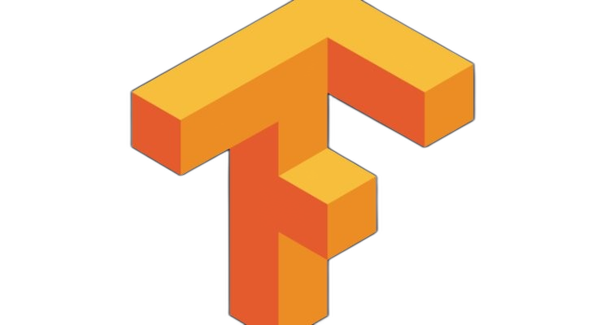
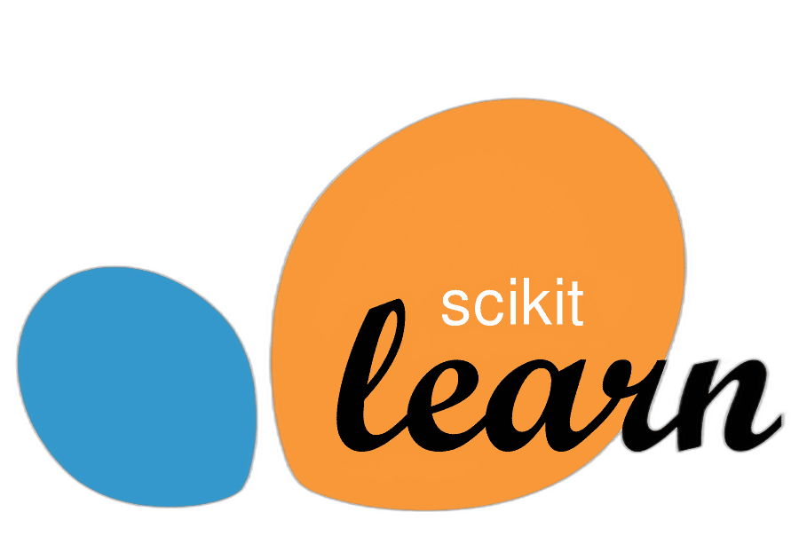
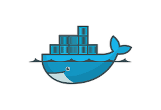
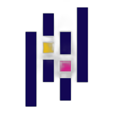

<!---
MuhammadUmerKhan/MuhammadUmerKhan is a ✨ special ✨ repository because its `README.md` (this file) appears on your GitHub profile.
You can click the Preview link to take a look at your changes.
--->

# Hi there, I'm Muhammad Umer Khan 👋
  
I'm an aspiring **Data Scientist** passionate about using data to uncover hidden insights and solve real-world problems. Welcome to my GitHub profile, where I showcase my projects, skills, and interests in the fields of **Data Science**, **Machine Learning**, **Deep Learning**, and more! 

## I'm a Data Scientist! 
    
---

### 🔭 Current Focus
I am currently working as a **Data Scientist** and actively looking for new opportunities to contribute my skills. Whether it's using machine learning to optimize processes, developing predictive models, or generating insights from complex datasets, I'm ready to tackle new challenges. 

### 🌱 What I'm Learning
- Deep diving into **Data Science** techniques, exploring advanced topics like **Computer Vision**, **Natural Language Processing (NLP)**, and **Time Series Analysis**.
- Expanding my knowledge in **Audio Deep Learning** and **Satellite Image Segmentation**.
- Continuously improving my skills with **Deep Learning** frameworks such as TensorFlow and PyTorch.

### 🥅 Goals for 2024
- Conduct research in **Cutting-Edge AI** fields, particularly in **Time Series Forecasting**, **NLP**, and **Generative AI**.
- Contribute to open-source **AI projects**.
- Build impactful, real-world applications with **Machine Learning**, **Deep Learning**, and **AI** to solve business problems.
- Collaborate with AI communities to advance shared learning.

### ⚡ Fun Fact
I’m a huge coding enthusiast. When I'm not training machine learning models, you'll often find me experimenting with new libraries and frameworks, participating in hackathons, or teaching others about AI.

---

## 💻 Technologies and Tools I Use

I am proficient in a variety of programming languages, frameworks, and tools that help me solve complex data science problems and build efficient solutions.

    <table align="center">
        <tr>
            <td align="center" width="140" height="112.43">
                
                  Python
            </td>
            <td align="center" width="140" height="112.43">
                
                  Jupyter Notebooks
            </td>
            <td align="center" width="140" height="112.43">
                
                  TensorFlow
            </td>
            <td align="center" width="140" height="112.43">
                
                  Scikit Learn
            </td>
            <td align="center" width="140" height="112.43">
                
                  FastAPI
            </td>
            <td align="center" width="140" height="112.43">
                
                  Docker
            </td>
        </tr>
        <tr>
            <td align="center" width="140" height="112.43">
                
                  PyTorch
            </td>
            <td align="center" width="140" height="112.43">
                
                  NumPy
            </td>
            <td align="center" width="140" height="112.43">
                
                  Pandas
            </td>
            <td align="center" width="140" height="112.43">
                
                  SQL
            </td>
            <td align="center" width="140" height="112.43">
                
                  Power BI
            </td>
            <td align="center" width="140" height="112.43">
                
                  Git
            </td>
        </tr>
    </table>

---

## 🔬 My Projects
Here are some of the exciting projects I've worked on:
1. **Customer Churn Prediction**: Built a model to predict customer churn using classification algorithms like XGBoost and Random Forest. Deployed it using FastAPI.
2. **House Price Prediction**: Developed a regression model to predict house prices based on key features using the Boston Housing dataset.
3. **Natural Language Processing**: Created an NLP pipeline for text classification, sentiment analysis, and Named Entity Recognition (NER) using libraries like SpaCy and NLTK.
4. **WhatsApp Chat Analysis**: Analyzed personal WhatsApp chat data to extract meaningful insights using Python, Pandas, and Matplotlib.
5. **Chatbot Development**: Built a Dialogflow chatbot integrated with a FastAPI backend to manage food orders, with database support using MySQL.

Feel free to explore these projects in my repositories!

---

## 🌐 Connect with Me
- LinkedIn: [Muhammad Umer Khan](https://www.linkedin.com/in/muhammad-umer-khan-61729b260/)
- GitHub: [ratul1214](https://github.com/ratul1214)
- Portfolio: (Coming soon!)

---

## ⚙️ Stats and Activity

---

***Thanks for visiting my profile! Feel free to reach out if you'd like to collaborate or chat about anything related to AI, Data Science, or coding.*** 😊
